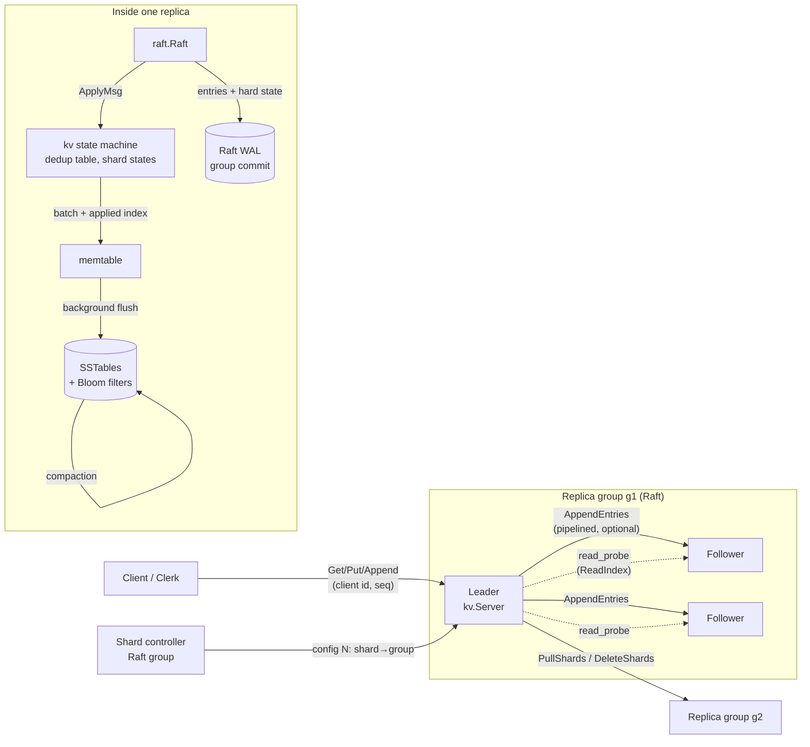

# Strata

Strata is a fault-tolerant, sharded key-value store written from scratch in Go. Each shard group is replicated with a hand-written Raft implementation that includes pre-vote, check-quorum, fast log backtracking, group-committed fsyncs, snapshots and ReadIndex reads. The Raft log doubles as the write-ahead log for an LSM-tree storage engine (skiplist memtable, SSTables with Bloom filters, background flush and compaction). On top sits a linearizable Get/Put/Append service that deduplicates client retries. A Raft-replicated shard controller assigns 64 shards to replica groups with bounded-load consistent hashing, and groups migrate shards between each other while serving traffic. Correctness is checked by injecting partitions, crashes, message loss and reordering into simulated clusters, then verifying the recorded histories with [porcupine](https://github.com/anishathalye/porcupine). Real processes are also killed mid-write and every acknowledged write is checked after restart.

## Architecture



| Package | Role |
|---|---|
| `raft` | Raft: elections with pre-vote and check-quorum, replication, persistence, snapshots, ReadIndex with dedicated probes |
| `storage/wal` | CRC-framed append-only log with group commit (concurrent `Sync` calls share one fsync) |
| `storage/lsm` | skiplist memtable, SSTables with Bloom filters and CRC'd blocks, atomic manifest, background flush and compaction |
| `kv` | replicated state machine: linearizable ops, client dedup, shard migration states |
| `shard` | consistent-hash ring with bounded loads, Raft-replicated controller, sharded clerk |
| `transport/grpcx`, `transport/sim` | gRPC transport; in-memory network with partitions, loss, delay and reordering |
| `harness` | fault-injection clusters and porcupine checking |
| `cmd/*` | `strata-server`, `strata-bench`, `strata-lincheck`, `strata-crashtest` |

## Quickstart

Requires Go 1.27+.

```bash
go test ./...                                   # unit, cluster and linearizability tests
go build -o bin/ ./cmd/...

# 5-node local cluster (logs and data in tmp/cluster), then load it
bash scripts/local-cluster.sh start unsharded
./bin/strata-bench -nodes 1=127.0.0.1:7001,2=127.0.0.1:7002,3=127.0.0.1:7003,4=127.0.0.1:7004,5=127.0.0.1:7005 \
    -servers 1,2,3,4,5 -clients 64 -duration 20s
curl -s localhost:9101/status        # role, term, commit index
curl -s localhost:9101/metrics       # Prometheus
bash scripts/local-cluster.sh stop

# Sharded: 3-node controller + two 3-node groups
bash scripts/local-cluster.sh start sharded

# Checkers
./bin/strata-lincheck -n 1000 -workers 16
./bin/strata-crashtest -mode cluster -runs 50
```

Docker and Kubernetes:

```bash
docker compose up -d --build              # 5 nodes + Prometheus on :9090
docker compose run --rm bench             # load from inside the network
kubectl apply -f deploy/k8s/strata.yaml   # StatefulSet (pod strata-N = node N+1)
```

Prometheus metrics include `strata_raft_commit_latency_seconds`, `strata_raft_leader_changes_total`, `strata_raft_replication_lag_entries`, term, commit and applied indexes, and LSM table counts. `/debug/pprof` is on the same port.

## Benchmarks

Measured on an Intel Core Ultra 9 185H laptop (22 threads, NVMe SSD, Windows 11), with all 5 replicas and the load generator on the same machine. Full method, raw JSON and per-run numbers are in [RESULTS.md](RESULTS.md).

| Metric | Target | Measured | |
|---|---|---|---|
| Throughput, 5 nodes, 90/10 | 120K ops/s | 38.9K ops/s (median, 256 clients) | miss |
| p99 latency, 90/10 | 4 ms | 13.1 ms (median, 64 clients) | miss |
| Write throughput, fsync batching vs none | 3.2x | 25.2x | hit |
| Linearizability-checked histories | 50K | 50,000, all linearizable (10 fault scenarios) | hit |
| Crash-recovery runs passed | 1,000+ | 3,000 / 3,000 (WAL, LSM, real process kills) | hit |

The misses come from the test setup as much as the code. Five replicas plus the client saturate one laptop CPU (68–99% utility measured mid-run), and every node's fsync competes for one SSD (1.07 ms alone, about 1.9 ms with five processes syncing).

## Design decisions & tradeoffs

**ReadIndex instead of logging reads or using leases.** A read confirms leadership with one round of heartbeats and then reads locally, so reads never touch the log or the disk. Leader leases would skip even that round trip, but they're only safe if clock drift is bounded, and I didn't want correctness to depend on clocks. A new leader serves reads only after its no-op entry commits, because until then it doesn't know the true commit index.

**A separate RPC for read confirmations.** Profiling showed reads waiting behind writes: confirmations rode on AppendEntries, and the follower fsyncs before replying. A dedicated `read_probe` that the follower answers by checking only the term roughly tripled 90/10 throughput in a 10 s experiment (17K to 49K ops/s). The confirmation only needs a majority to acknowledge the leader's term, not to agree on the log.

**The Raft log is the WAL.** Writing each update to both a Raft log and an LSM WAL would double the fsyncs. Instead, every applied batch also stores the applied Raft index in the LSM. After a crash the LSM says exactly where Raft should resume replaying. Log compaction flushes the memtable and tells Raft it can drop the prefix (`Snapshot(idx, nil)`), and lagging followers get a fresh scan of the LSM.

**Group commit everywhere.** Concurrent fsync requests coalesce: one caller syncs and everyone who arrived meanwhile rides along. The Raft leader persists in parallel with replication and counts its own durable index toward the quorum. This is the 25x in the benchmark table. Without it, each write costs its own fsync on every node (about 1–2 ms here).

**Pipelining is off by default.** Allowing several AppendEntries in flight per follower is the textbook optimization, but measured here it split batches into more, smaller follower fsyncs on a shared disk. It helped only write-heavy load at 256 clients. It's kept behind `-max-inflight` and tested in both modes.

**64 fixed shards with bounded-load consistent hashing.** A fixed shard count keeps routing and migration simple: the unit of movement is a shard, not a key range. Plain consistent hashing over only 64 shards left some groups with several times the average. Capping each group at 1.25x the average keeps load even while still moving few shards when groups join or leave.

**Migrations go through each group's log, one config at a time.** Pull, install, delete and "cleaned" are all Raft entries, so any replica can crash at any step and resume. A group won't advance to config N+1 until every shard has settled from config N, which costs some migration speed but makes the state machine easy to reason about. Dedup state moves with the shard, so a retried write after a move is still applied exactly once.

**Simulated network for correctness, real processes for recovery.** The in-memory transport makes partitions, loss and reordering reproducible from a seed, and porcupine verifies every history. Histories are capped at about 500 operations because porcupine's search time explodes on 30K–300K-op histories. Process-kill tests on real servers then cover what the simulation can't, like file handles, ports and restart paths.
